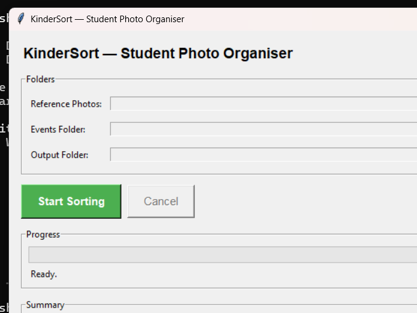
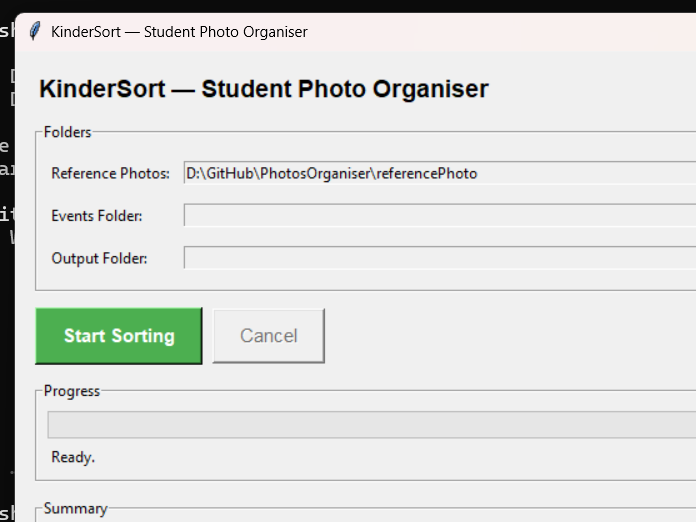
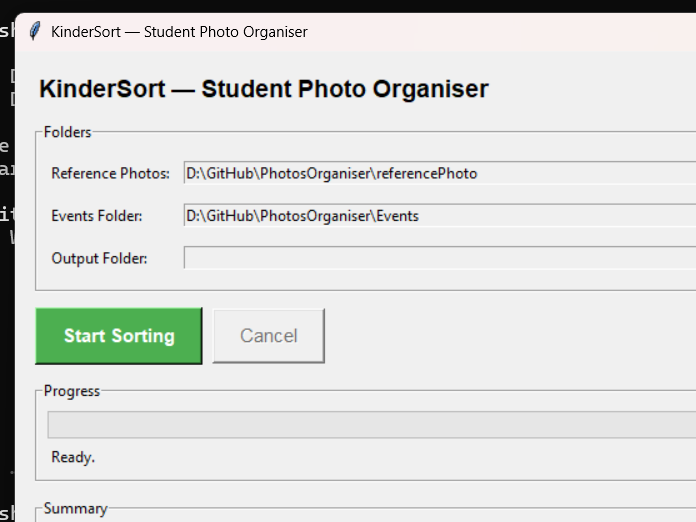
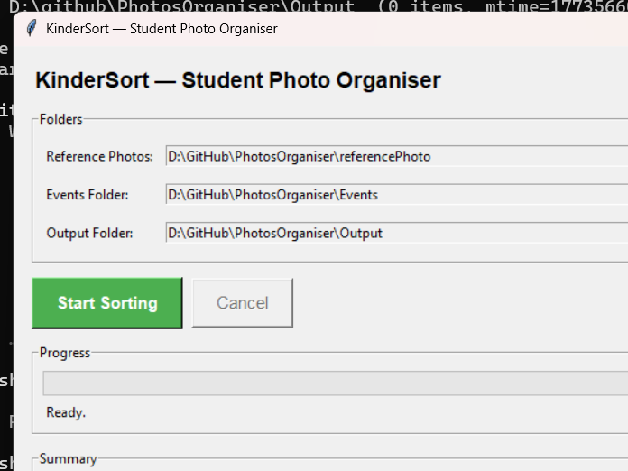
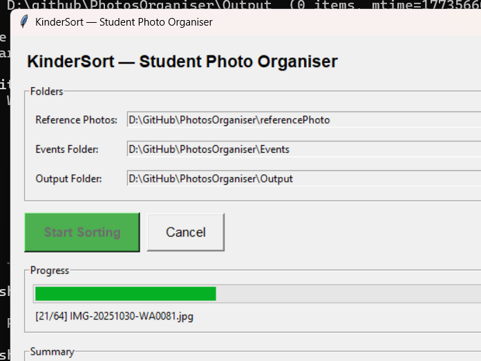
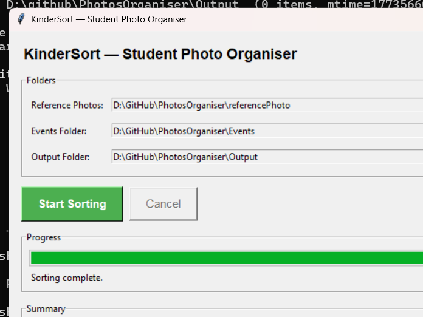

# KinderSort — Student Photo Organiser

[](https://github.com/lerlerchan/KinderSort/releases)
[](https://www.python.org/)
[](https://github.com/lerlerchan/KinderSort)
[](https://github.com/lerlerchan/KinderSort)
[](https://github.com/lerlerchan/KinderSort/releases)
[](https://github.com/lerlerchan/KinderSort/releases)

[中文说明 (简体)](README.zh-CN.md)

KinderSort is an offline desktop app for kindergarten teachers. It scans event photos, matches student faces, and copies each photo into the correct student folder automatically — no internet connection, no coding knowledge required.

---

## Highlights

| Feature | Detail |
|---|---|
| Fully offline | No cloud upload, no internet required |
| CPU-only | Works on any Windows PC without a GPU |
| Simple GUI | Point-and-click, no terminal needed |
| Group photo support | One photo copied to all matched students |
| Safe operation | Files are **copied**, never moved or deleted |
| Audit trail | Detailed log written to `kindersort_log.txt` |

---

## Who this is for

- Teachers who need to organise large batches of student photos quickly
- Schools that require local/offline processing for privacy

---

## Quick Start (Teachers)

1. Download `KinderSort.exe` from the [**Releases**](https://github.com/lerlerchan/KinderSort/releases) page
2. Double-click `KinderSort.exe` — no installation needed
3. Select the three folders (Reference / Events / Output)
4. Click **Start Sorting**
5. Review the summary and open the Output folder

Full illustrated teacher guide: [`guidebook.md`](guidebook.md)

---

## Screenshot Walkthrough

| Step | Screenshot |
|---|---|
| 1. App launch |  |
| 2. Reference folder selected |  |
| 3. Events folder selected |  |
| 4. All folders ready |  |
| 5. Sorting in progress |  |
| 6. Sorting complete |  |

---

## Folder Setup

You choose three folders inside the app:

1. **Reference Photos** — one clear front-facing photo per student, file name = student name
   ```
   reference/
     Ali.jpg
     Siti.png
     Kumar.jpeg
   ```

2. **Events Folder** — subfolders of mixed event photos
   ```
   events/
     Sports_Day/
     Concert/
     Field_Trip/
   ```

3. **Output Folder** — where sorted results are written

---

## Output Structure

```text
Output/
  Ali/
    Sports_Day__IMG_001.jpg
    Concert__IMG_045.jpg
  Siti/
    Sports_Day__IMG_001.jpg    ← same photo, Siti was also in it
    Field_Trip__IMG_023.jpg
  _unmatched/
    blurry_photo.jpg
    no_face_detected.jpg
  kindersort_log.txt
```

---

## Important Behaviour

- Face matching threshold is `0.5` (strict — minimises false positives)
- Photos are **copied**, not moved — originals are always safe
- Photos placed directly in the Events root (no subfolders) are also supported — the folder name is used as the event name
- If a reference photo has no detectable face, that student is skipped with a warning

---

## Tech Stack

[](https://github.com/ageitgey/face_recognition)
[](https://python-pillow.org/)
[](https://docs.python.org/3/library/tkinter.html)
[](https://pyinstaller.org/)

| Component | Library |
|---|---|
| Face recognition | `face_recognition` + `dlib` |
| Image handling | `Pillow` |
| GUI | `tkinter` (built-in) |
| Packaging | `PyInstaller` |
| Language | Python 3.10+ |

---

## Developer Setup

```bash
python -m venv .venv
.venv\Scripts\activate
pip install -r requirements.txt
python main.py
```

Build Windows executable:

```bash
pyinstaller --onefile --windowed --name "KinderSort" main.py
# Output: dist/KinderSort.exe
```
