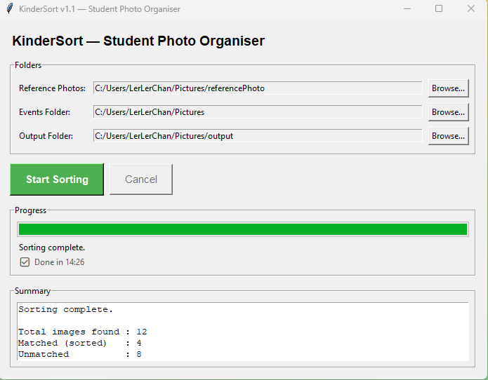

# KinderSort — 幼儿园学生照片整理工具

[](https://github.com/lerlerchan/KinderSort/releases)
[](https://www.python.org/)
[](https://github.com/lerlerchan/KinderSort)
[](https://github.com/lerlerchan/KinderSort)
[](https://github.com/lerlerchan/KinderSort/releases)
[](https://github.com/lerlerchan/KinderSort/releases)

[English](README.md)

KinderSort 是一个离线桌面工具，面向幼儿园老师。它会扫描活动照片，识别学生人脸，并自动把照片复制到对应学生文件夹——无需网络连接，无需任何编程知识。

---

## 功能亮点

| 功能 | 说明 |
|---|---|
| 全离线运行 | 不需要上传云端，不需要联网 |
| 仅使用 CPU | 普通 Windows 电脑无需显卡即可运行 |
| 简易图形界面 | 点击操作，无需使用命令行 |
| 支持合照 | 同一张照片可复制到多个学生文件夹 |
| 安全操作 | 照片只会**复制**，不会移动或删除原图 |
| 操作日志 | 自动生成 `kindersort_log.txt` 详细记录 |

---

## 适用场景

- 老师需要快速整理大量学生活动照片
- 学校对隐私有要求，必须本地离线处理

---

## 使用步骤（老师快速上手）

1. 从 [**Releases**](https://github.com/lerlerchan/KinderSort/releases) 页面下载 `KinderSort.exe`
2. 双击运行 `KinderSort.exe`——无需安装
3. 依次选择三个目录（Reference / Events / Output）
4. 点击 **Start Sorting**
5. 查看完成摘要并打开输出目录确认结果

完整图文使用手册：[`guidebook.md`](guidebook.md)

---

## 界面截图步骤

| 步骤 | 截图 |
|---|---|
| 1. 程序启动界面 |  |
| 2. 已选择参考照片目录 |  |
| 3. 已选择活动照片目录 |  |
| 4. 三个目录都已设置完成 |  |
| 5. 正在整理照片 |  |
| 6. 整理完成摘要 |  |
| 7. 整理中——计时器显示 |  |

---

## 目录设置要求

在程序中需要选择 3 个文件夹：

1. **Reference Photos（参考照片）** — 每位学生一张清晰正脸照，文件名即学生姓名
   ```
   reference/
     Ali.jpg
     Siti.png
     Kumar.jpeg
   ```

2. **Events Folder（活动照片目录）** — 包含多个活动子文件夹
   ```
   events/
     Sports_Day/
     Concert/
     Field_Trip/
   ```

3. **Output Folder（输出目录）** — 整理结果写入位置

---

## 输出结构示例

```text
Output/
  Ali/
    Sports_Day__IMG_001.jpg
    Concert__IMG_045.jpg
  Siti/
    Sports_Day__IMG_001.jpg    ← 同一张照片，Siti 也在里面
    Field_Trip__IMG_023.jpg
  _unmatched/
    blurry_photo.jpg
    no_face_detected.jpg
  kindersort_log.txt
```

---

## 关键行为说明

- 人脸匹配阈值为 `0.55`（偏严格，减少误匹配）
- 照片只会**复制**，不会移动原图，原始文件始终安全
- 支持将照片直接放在 Events 根目录（不含子文件夹），程序会以该文件夹名作为活动名称
- 参考照未检测到人脸时，会提示并跳过该学生
- v1.1 采用更高精度的人脸识别算法（CNN + 多次抖动处理）——整理 500 张照片通常需要 **8–15 分钟**；界面上的旋转计时器会持续更新，表示程序正常运行中

---

## 技术栈

[](https://github.com/ageitgey/face_recognition)
[](https://python-pillow.org/)
[](https://docs.python.org/3/library/tkinter.html)
[](https://pyinstaller.org/)

| 组件 | 库 |
|---|---|
| 人脸识别 | `face_recognition` + `dlib` |
| 图像处理 | `Pillow` |
| 图形界面 | `tkinter`（内置） |
| 打包工具 | `PyInstaller` |
| 开发语言 | Python 3.10+ |

---

## 开发者本地运行（源码）

```bash
python -m venv .venv
.venv\Scripts\activate
pip install -r requirements.txt
python main.py
```

打包 Windows 可执行文件：

```bash
pyinstaller --onefile --windowed --name "KinderSort" main.py
# 输出：dist/KinderSort.exe
```
